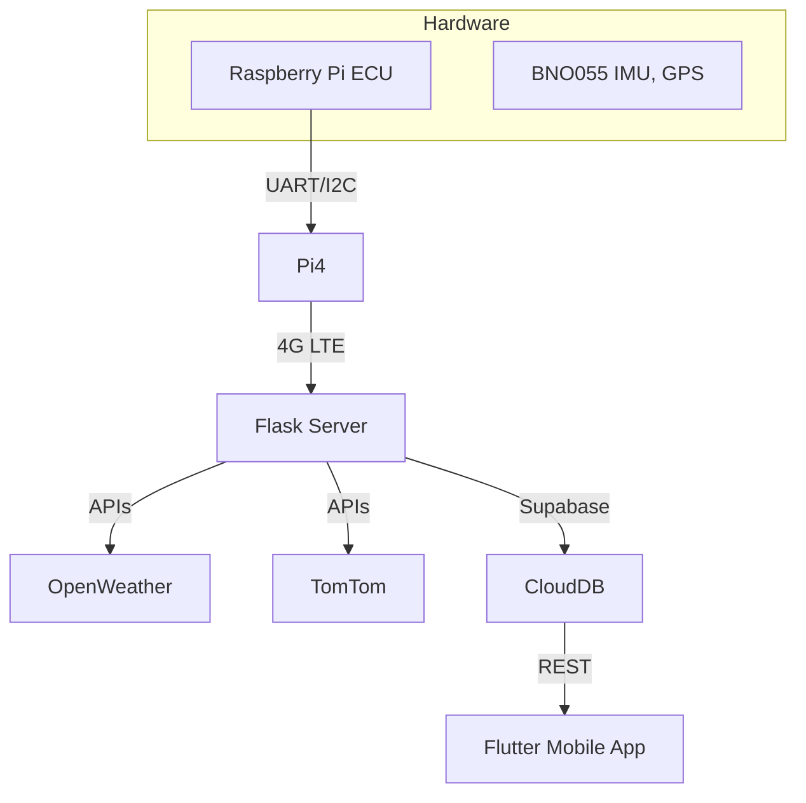

# AI-Based Smart Driver Assistant for Two-Wheelers

## Project Overview
An end-to-end Advanced Driver Assistance System (ADAS) tailored for electric two-wheelers in India. This solution combines hardware, software, and machine learning to provide real-time safety insights, vehicle diagnostics, and rider behavior analysis to reduce road fatalities.

## Key Features
- **Real-Time GPS Alerts**: Shows hazards, unsafe road segments, and weather warnings via MapMyIndia and OpenWeather APIs.
- **Vehicle Diagnostics**: Monitors battery voltage, current, temperature, motor RPM, and brake pressure; detects anomalies in sensor readings.
- **Personalized Risk Scoring**: AI-driven rider behavior analysis assigns risk scores for sudden acceleration, drowsy driving, and erratic maneuvers.
- **Anomaly Detection Models**: Multi-output regression (LSTM, GRU, AdaBoost, XGBoost, MLP+RF Ensemble) for real-time anomaly alerts.
- **Behavior Analysis Models**: CNN, CNN+RF, Autoencoder (Dense & CNN) + RF for classifying rider profiles (normal, haphazard, sleepy, aggressive).
- **Cloud Sync & Storage**: Uses Supabase for encrypted data storage and Flutter for cross-platform mobile UI.

## Architecture


## Data Collection
- **Route**: 4 km test path in Chembur, Mumbai under sunny conditions.
- **Sensors**: Acceleration (X/Y/Z), Gyroscope (X/Y/Z), Orientation (pitch, roll, yaw), GPS.
- **APIs**: OpenWeather (weather), TomTom (traffic) at 0.33 s intervals.
- **Diagnostics Dataset**: Synthetic time-series (Dec 2021–Nov 2023) with 6 EV sensor channels, anomalies injected for fault simulation.

## Machine Learning
### Anomaly Detection
- **Models**: LSTM-Residual, GRU, AdaBoost, XGBoost, MLP+RF Ensemble
- **Approach**: Multi-output regression + static threshold on residuals for anomaly alerts

### Behavior Analysis
- **Models**: 1D CNN, CNN+RandomForest, Autoencoder (Dense & CNN) + RF
- **Metrics**: Accuracy, Precision, Recall, F1‑Score, ROC AUC

## Installation
### Backend (Flask)
```bash
cd backend
python3 -m venv venv
source venv/bin/activate
pip install -r requirements.txt
export MAPMYINDIA_KEY=YOUR_KEY
export OPENWEATHER_KEY=YOUR_KEY
export TOMTOM_KEY=YOUR_KEY
python app.py
```

### Frontend (Flutter)
```bash
cd flutter_app
flutter pub get
flutter run --release
```

## Remote Storage
- **Supabase**: Encrypted storage for ride logs and diagnostics; configure URL/anon key in `lib/config.dart`.

## Usage
1. Mount ECU on two‑wheeler and power on.
2. Start Flask server and ensure internet connectivity.
3. Launch Flutter app; sign in and sync to view real-time data.

## Contributing
1. Fork the repo.
2. Create a feature branch: `git checkout -b feature/YourFeature`.
3. Commit changes: `git commit -m "Add your feature"`.
4. Push: `git push origin feature/YourFeature`.
5. Open a Pull Request.

## License
MIT © 2024 Vivekanand Education Society’s Institute of Technology
